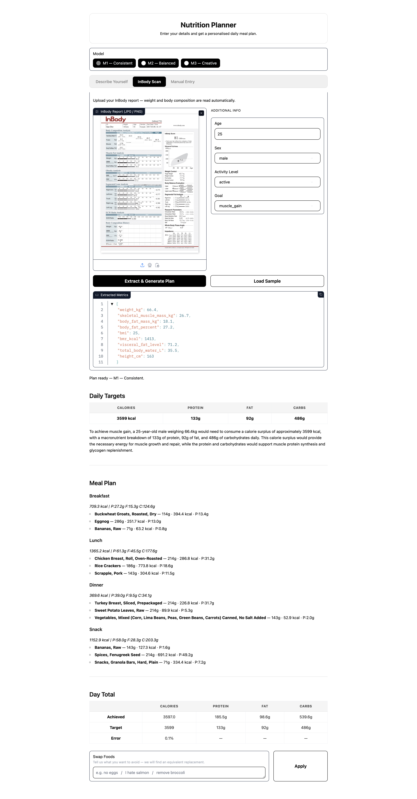
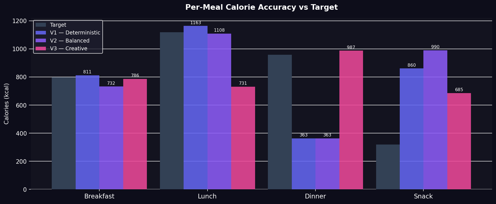
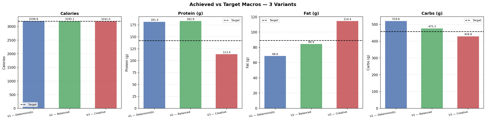
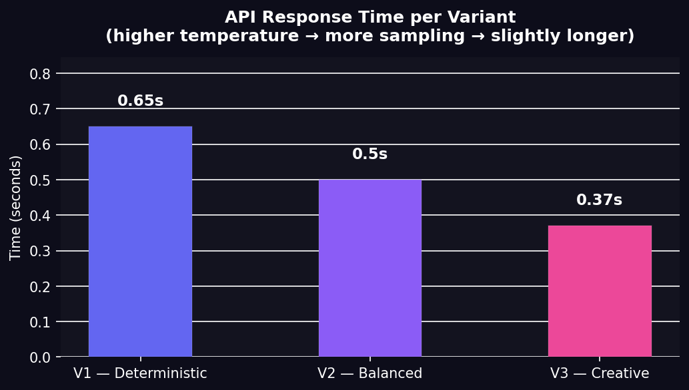

# Nutrition NLP Agents

> **A multi-agent NLP system that turns an InBody scan + a goal into a personalized meal plan.** Cooperating agents read the user's body-composition scan, look up nutrients in USDA FoodData Central, and an LLM generates and validates meal plans and variants.


**▶️ Live demo:** _paste your Space URL here after deploy_ · 🚀 **Deploy guide:** [DEPLOY.md](./DEPLOY.md) (Hugging Face Spaces, free)

---

<p align="center">
  <br>
  <em>The Gradio interface: upload an InBody scan, get a tailored meal plan</em>
</p>

## Features

- 🤖 **Multi-agent pipeline** — separate agents interpret the request, extract scan data, look up nutrition facts, and generate plans
- 📷 **InBody scan reading** — parses a body-composition scan image into structured inputs
- 🥗 **Grounded meal plans** — nutrient lookups backed by the **USDA FoodData Central** dataset (not hallucinated)
- 🔀 **Variant generation & evaluation** — produces meal variants and benchmarks them (accuracy, macros, response time)
- 🖥️ **Gradio UI** — single-file `app.py` interface

## Evaluation

The pipeline was benchmarked across variants — meal accuracy, macro distribution, food overlap, and latency:

<p align="center">
  
  
  
</p>

## Architecture

```
agent1.py / agent3.py / Agent_2.ipynb / agent4.ipynb   pipeline agents
tools.ipynb        shared tools / function calling
pipeline*.ipynb    end-to-end pipelines (incl. Hugging Face variant)
variants.ipynb     meal-variant generation + evaluation
app.py             Gradio entry point
FoodData_Central_sr_legacy_food_csv_2018-04/   USDA nutrient dataset
```

## Tech Stack

- **Python**, **Gradio** (UI)
- LLM APIs — **Groq** (primary) and **Hugging Face**
- USDA FoodData Central (CSV) for nutrient lookups
- Jupyter notebooks documenting each agent

## Getting Started

```bash
pip install gradio groq pandas requests   # core deps used by app.py
export GROQ_API_KEY=your_key               # set your own key
python app.py                              # launches the Gradio app
```

## Configuration

API keys are read from environment variables — set your own before running:

```bash
export GROQ_API_KEY=your_key
export HF_TOKEN=your_token   # optional, for the Hugging Face variant
```

> The code uses placeholders (`<YOUR_GROQ_API_KEY>`, `<YOUR_HF_TOKEN>`). Never hardcode real keys — load them from the environment.
